# Fauxdan - Elite Internet Intelligence Platform

**Fauxdan** is a sophisticated network reconnaissance and intelligence gathering platform that combines cybersecurity learning with community service. It provides comprehensive network scanning capabilities while maintaining ethical scanning practices.

## 🎯 Mission

Fauxdan exists at the intersection of learning and contribution. While developing cybersecurity expertise, it simultaneously provides the community with valuable network intelligence that enhances collective security awareness.

## 🏗️ Architecture

### Infrastructure Topology

```mermaid
graph TB
    %% External Access
    INTERNET[Internet]
    
    %% Staging Environment
    subgraph "Staging Environment"
        STAGING[staging.fauxdan.icarostangent.lab<br/>Ubuntu 22.04<br/>Development/Testing]
    end
    
    %% Docker Swarm Cluster
    subgraph "Docker Swarm Cluster"
        %% Swarm Master
        subgraph "Swarm Management"
            MASTER[swarm-master-01.fauxdan.icarostangent.lab<br/>Swarm Manager<br/>Orchestration & Management]
        end
        
        %% Edge Nodes
        subgraph "Edge Layer"
            EDGE[swarm-edge-01.fauxdan.icarostangent.lab<br/>Edge Node<br/>Public-facing Services]
        end
        
        %% Worker Nodes
        subgraph "Worker Layer"
            WORKER1[swarm-worker-01.fauxdan.icarostangent.lab<br/>Worker Node 1<br/>Application Services]
            WORKER2[swarm-worker-02.fauxdan.icarostangent.lab<br/>Worker Node 2<br/>Application Services]
        end
        
        %% Storage Node
        subgraph "Storage Layer"
            STORAGE[swarm-storage-01.fauxdan.icarostangent.lab<br/>Storage Node<br/>Data Persistence & Backups]
        end
    end
    
    %% Service Deployments
    subgraph "Edge Services"
        CADDY[Caddy Proxy<br/>SSL Termination<br/>Load Balancing]
        FRONTEND[Vue.js Frontend<br/>Static Assets]
    end
    
    subgraph "Worker Services"
        BACKEND[Django Backend<br/>API Services]
        SCANNER[Scanner Service<br/>Masscan Integration]
        REDIS[Redis Cache<br/>Session Store]
        MONITORING[Monitoring Stack<br/>Prometheus/Grafana]
    end
    
    subgraph "Storage Services"
        POSTGRES[PostgreSQL<br/>Primary Database]
        ELASTICSEARCH[Elasticsearch<br/>Log Storage]
        BACKUP[Backup Storage<br/>Automated Backups]
    end
    
    %% Connections
    INTERNET --> STAGING
    INTERNET --> EDGE
    
    MASTER --> EDGE
    MASTER --> WORKER1
    MASTER --> WORKER2
    MASTER --> STORAGE
    
    EDGE --> CADDY
    EDGE --> FRONTEND
    
    WORKER1 --> BACKEND
    WORKER1 --> REDIS
    WORKER2 --> SCANNER
    WORKER2 --> MONITORING
    
    STORAGE --> POSTGRES
    STORAGE --> ELASTICSEARCH
    STORAGE --> BACKUP
    
    %% Styling
    classDef stagingNode fill:#fff3e0,stroke:#f57c00,stroke-width:2px
    classDef masterNode fill:#e3f2fd,stroke:#1976d2,stroke-width:3px
    classDef edgeNode fill:#e8f5e8,stroke:#388e3c,stroke-width:2px
    classDef workerNode fill:#f3e5f5,stroke:#7b1fa2,stroke-width:2px
    classDef storageNode fill:#fce4ec,stroke:#c2185b,stroke-width:2px
    classDef service fill:#fff8e1,stroke:#f9a825,stroke-width:1px
    
    class STAGING stagingNode
    class MASTER masterNode
    class EDGE edgeNode
    class WORKER1,WORKER2 workerNode
    class STORAGE storageNode
    class CADDY,FRONTEND,BACKEND,SCANNER,REDIS,MONITORING,POSTGRES,ELASTICSEARCH,BACKUP service
```



### Core Components

- **Backend**: Django REST API with PostgreSQL for data persistence
- **Frontend**: Vue.js 3 with TypeScript and modern UI/UX design
- **Scanner**: Custom integration with Masscan for high-performance port discovery
- **Infrastructure**: Docker-based microservices deployment with Redis caching
- **Monitoring**: Prometheus, Grafana, Elasticsearch, Logstash, and Kibana stack

### Services

- **Backend**: Main API server 
- **Backend-Admin**: Admin-specific functionality 
- **Scanner**: Background port scanning service with NET_ADMIN capabilities
- **Database**: PostgreSQL with health checks and automated backups
- **Cache**: Redis for session management and caching
- **Proxy**: Caddy reverse proxy with SSL termination
- **Tor**: Anonymous scanning capabilities
- **Monitoring**: Full observability stack with metrics, logs, and dashboards

## 🚀 Quick Start

### Prerequisites

- Docker and Docker Compose
- Git access to the repository
- Environment variables configured

### Environment Setup

1. Copy the environment template:
   ```bash
   cp env.template .env
   ```

2. Configure required variables in `.env`:
   - Database credentials
   - Django secret key
   - Domain configuration
   - SSL certificate settings

### Deployment
#### Development Environment
```bash
docker compose -f docker-compose.dev.yml --env-file .env.dev up -d
```

#### Docker Swarm
- swarm-mgmt status - Show swarm and service status
- swarm-mgmt nodes - List all nodes
- swarm-mgmt services - List all services
- swarm-mgmt logs <service> - Show service logs
- swarm-mgmt scale <service> <replicas> - Scale a service
- swarm-mgmt update <service> - Force update a service