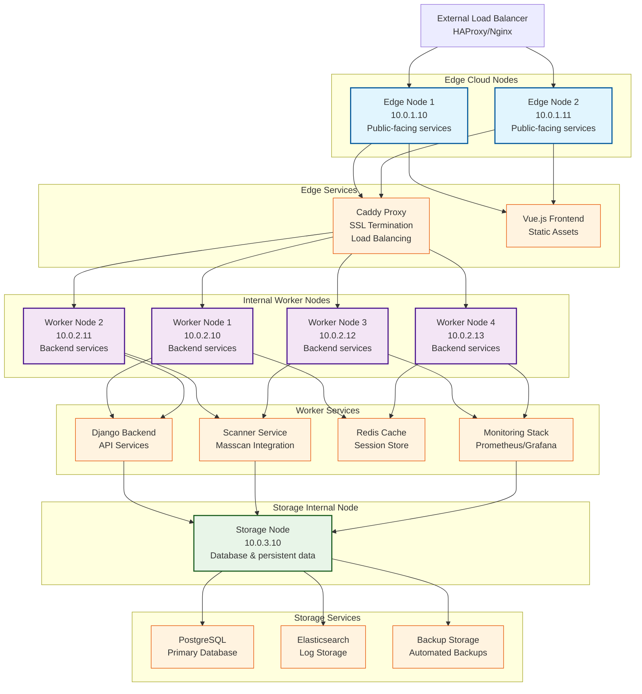

# Fauxdan Docker Swarm Architecture

## Proposed Swarm Topology



## Node Specifications

### Edge Cloud Nodes (2x)
- **Purpose**: Public-facing services, SSL termination, load balancing
- **Services**: Caddy proxy, Vue.js frontend, SSL certificates
- **Resources**: 2 CPU, 4GB RAM, 20GB SSD
- **Network**: Public IP, DMZ network access
- **High Availability**: Active-active configuration

### Internal Worker Nodes (4x)
- **Purpose**: Application services, scanning, monitoring
- **Services**: Django backend, scanner service, Redis, monitoring stack
- **Resources**: 4 CPU, 8GB RAM, 50GB SSD
- **Network**: Internal network only, no public access
- **Scalability**: Horizontal scaling for backend services

### Storage Internal Node (1x)
- **Purpose**: Data persistence, backups, log storage
- **Services**: PostgreSQL, Elasticsearch, backup storage
- **Resources**: 8 CPU, 16GB RAM, 500GB SSD + 2TB HDD
- **Network**: Internal network only, high-speed storage access
- **Reliability**: RAID configuration, automated backups

## Service Distribution Strategy

### Edge Services
- **Caddy Proxy**: Deployed on both edge nodes with load balancing
- **Frontend**: Static assets served from edge nodes
- **SSL Termination**: Handled at edge layer

### Worker Services
- **Backend API**: Distributed across worker nodes (2-3 replicas)
- **Scanner Service**: Dedicated worker nodes for scanning tasks
- **Redis**: High availability across multiple worker nodes
- **Monitoring**: Prometheus/Grafana on dedicated worker nodes

### Storage Services
- **PostgreSQL**: Primary database on storage node
- **Elasticsearch**: Log storage and search on storage node
- **Backups**: Automated backup storage on storage node

## Network Architecture

### Network Segments
- **DMZ (10.0.1.0/24)**: Edge nodes with public access
- **Internal (10.0.2.0/24)**: Worker nodes for application services
- **Storage (10.0.3.0/24)**: Storage node for data persistence

### Security Considerations
- **Edge nodes**: Public-facing with firewall rules
- **Worker nodes**: Internal network only, no public access
- **Storage node**: Isolated network segment, encrypted storage

## Deployment Commands

### Initialize Swarm
```bash
# On manager node (Edge Node 1)
docker swarm init --advertise-addr 10.0.1.10

# Join worker nodes
docker swarm join --token <token> 10.0.1.10:2377
```

### Deploy Services
```bash
# Deploy edge services
docker stack deploy -c docker-compose.edge.yml fauxdan-edge

# Deploy worker services
docker stack deploy -c docker-compose.worker.yml fauxdan-worker

# Deploy storage services
docker stack deploy -c docker-compose.storage.yml fauxdan-storage
```

### Scaling Services
```bash
# Scale backend services
docker service scale fauxdan_backend=3

# Scale scanner services
docker service scale fauxdan_scanner=2

# Scale monitoring services
docker service scale fauxdan_prometheus=1
docker service scale fauxdan_grafana=1
```

## High Availability Features

- **Service Replication**: Critical services replicated across nodes
- **Health Checks**: Automated service health monitoring
- **Rolling Updates**: Zero-downtime deployments
- **Load Balancing**: Automatic traffic distribution
- **Data Backup**: Automated backup and recovery procedures

## Monitoring & Management

- **Swarm Dashboard**: Built-in Docker Swarm monitoring
- **Prometheus**: Metrics collection and alerting
- **Grafana**: Visualization and dashboards
- **Log Aggregation**: Centralized logging with Elasticsearch
- **Health Checks**: Service and node health monitoring
